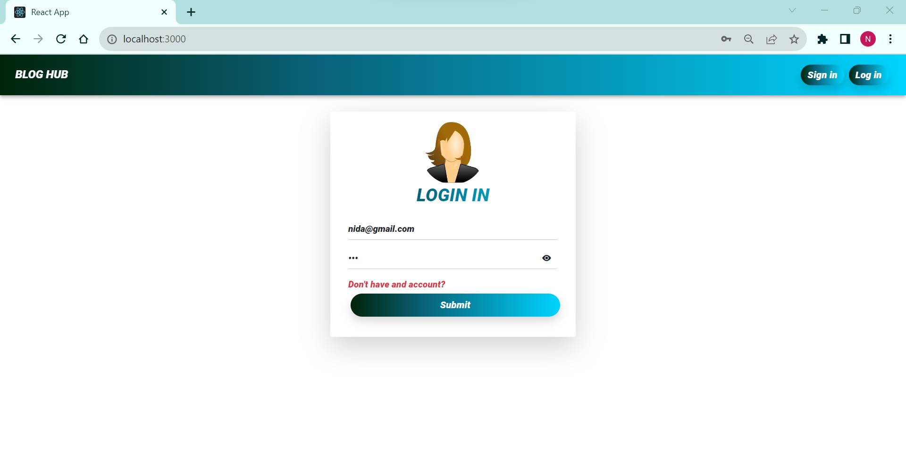
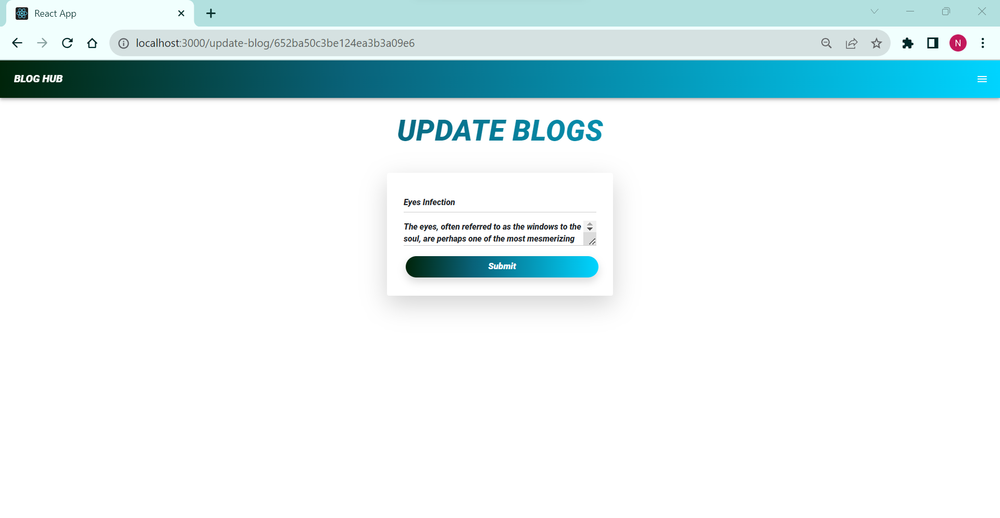

# MERN Blog Hub

Blog Hub allow you to perform CURD operation, add blog, can see all user blogs, update user blog and delete blog(Update and delete options are only available for the user's own blog). Allow user to update there personal information their name and password.

## Overview

- **Frontend**: React.js with Material UI
- **Responsiveness**: Fully responsive design
- **Backend**: Node.js and Express
- **Database**: MongoDB
- **Security**: Passwords encrypted with bcrypt.js
- **Architecture**: MVC pattern

## Prerequisites

- **Node.js**: Node.js should be installed on your system as it's required to run the project.
- **MongoDB**: MongoDB should be set up and running since it serves as the database for your application.
- **Dependencies**: Please review the project's `package.json` file to see the list of Node.js modules and libraries used in this project.

## Technologies Used
- React JS
- Express JS
- Node JS
- Mongodb
- Redux.js

## How to Run

In terminal run "npm i" command and run same command in backend folder

## Screenshots

    <b>Sign In Page</b>

    <b>Login Page</b>

    <b>Add Blog</b>

    <b>My Blog</b>

    <b>All Blog</b>

    <b>Update Blog</b>

    <b>Update User Info</b>

    <b>Delete Blog</b>

